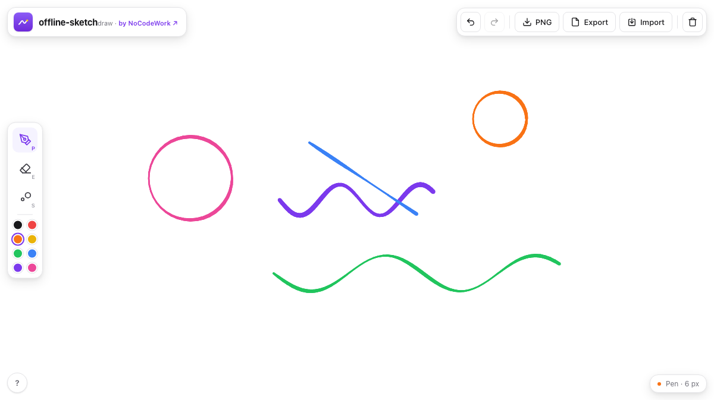

<div align="center">


# offline-sketch

A sketchpad that's just one HTML file. Open it and draw — with a pressure-sensitive pen if you have one (Apple Pencil, Wacom, an iPad). No signup, no install, and nothing leaves your browser.

[](LICENSE)


**[Open the live demo](https://nocodework.github.io/offline-sketch/)** and draw something, or [download `index.html`](https://raw.githubusercontent.com/nocodework/offline-sketch/main/index.html) and open it on any machine, even one with no internet.



</div>

## The idea

Sometimes you just want to scribble an idea — on a tablet with a stylus, or with a mouse — without opening a heavy app or signing into anything. offline-sketch is a sketchpad in a single file. You open it and draw. Strokes are pressure-sensitive when you use a pen, so lines taper like the real thing.

Everything is saved in this browser and never sent anywhere. Open the Network tab and reload if you want to check: the only thing that loads is the page itself.

Because the drawing lives in your browser, it's tied to that browser on that machine. To keep something, use Export (PNG, or `.json` you can re-import).

## What it does

- A pressure-sensitive pen (real pressure with a stylus; smooth, tapered strokes)
- Eraser, eight colours, and an adjustable brush size
- Undo and redo
- Export to PNG, export/import the drawing as `.json`
- Saves to the browser automatically
- Works with a mouse, a finger, or a stylus (Apple Pencil, Wacom, iPad)

## Using it

Open the [live demo](https://nocodework.github.io/offline-sketch/) and draw. To use it offline, download `index.html` and double-click it. It's a static file, so you can keep it on a USB stick, drop it on any web host, or `git clone` and open it.

Grab the file from a terminal (this also works inside Claude Code or Codex):

```bash
curl -O https://raw.githubusercontent.com/nocodework/offline-sketch/main/index.html
open index.html      # macOS  ·  Linux: xdg-open index.html  ·  Windows: start index.html
```

## Keyboard shortcuts

| Key | Action | Key | Action |
|---|---|---|---|
| `P` | Pen | `[` `]` | Smaller / bigger brush |
| `E` | Eraser | `⌘Z` / `⌘⇧Z` | Undo / redo |
| `S` | Brush size | | |

## What's private about it

There's no backend, so there's nowhere for your drawings to go. No account, no cookies, no analytics, and no fonts pulled from a CDN. Your drawing sits in your browser's local storage on your own device. Export saves a copy. The whole thing is one readable file, so if you'd rather not take my word for it, open `index.html` and read it.

## How it works

Plain JavaScript, no libraries. Drawing uses Pointer Events, including `getCoalescedEvents()` for high-fidelity stylus input and `pressure` for variable line width. Each stroke is kept as a list of pressured points, so undo, redo, resizing, export and autosave all work from the same data. Strokes are saved to local storage.

## How it compares

|  | offline-sketch | Excalidraw | Procreate / native apps |
|---|:---:|:---:|:---:|
| Works with no internet | yes | needs PWA install | yes |
| No account, nothing to install | yes | mostly | needs install |
| Pressure-sensitive stylus | yes | limited | yes |
| Single file you own | yes | no | no |
| Open source | yes | yes | no |

It's deliberately small: a sketchpad you can carry around in one file. For full illustration or layers, a native app like Procreate will serve you better.

## Part of the offline series

offline-sketch is one of a small family of single-file, offline-first tools by NoCodeWork. Same idea every time: one HTML file, no account, no server, works offline.

- [**offline-whiteboard**](https://github.com/nocodework/offline-whiteboard) — sticky notes, shapes and arrows on an infinite canvas ([demo](https://nocodework.github.io/offline-whiteboard/))
- [**offline-notes**](https://github.com/nocodework/offline-notes) — a Markdown editor that renders as you type ([demo](https://nocodework.github.io/offline-notes/))
- **offline-sketch** — you're here

## Contributing

Issues and pull requests are welcome, see [CONTRIBUTING.md](CONTRIBUTING.md). It's one file with no toolchain, so there's nothing to set up first.

## License

[MIT](LICENSE), by [NoCodeWork](https://nocodework.io). Do whatever you want with it.

---

<div align="center">
Built by <a href="https://nocodework.io">NoCodeWork</a>, where we make automation and AI apps for companies.
</div>
